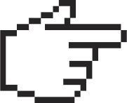

# Encabezado
## subtitulo
### Encabezado 3


# Énfasis y negrita

*Texto en cursiva*  o  _Texto en cursiva_

**Texto en negrita**

***Itálica negrita***


# Listas
- Elemento de lista
- Otro elemento
  1. Subelemento
   

* Viñetas
* Otra viñeta


> align-item: flex-start
<h1 align="center"> Su título aquí </h1>
> align-item: flex-start
>
> 

  # Enlace

[click](url...)

[Texto del vínculo](URL_del_vínculo)


 # Imágenes




<ol>
<li>habilidades</li>
<li>habilidades</li>
<li>habilidades</li>
</ol>


conceptos básico de `HTML`, `CSS` y `JS`

```
// Bloque de código
for(int i = 0; i < 10; i++) {
printf(“Valor de i = %d”, i)
}
```

- item1
- item2